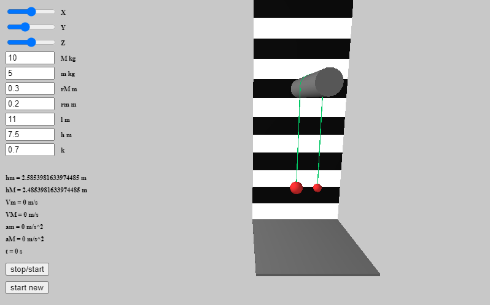

# Pulley system simulation
Project made with processing p5.js.

Physical simulation of pulley system with fixed block.
Collision of the block with weights and friction force between block and rope are ignored. Also rope is not elastic.

To launch simply clone repository or download zip and then open index.html.

